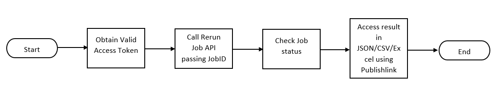

AIMS360 Aqua API
----------------

### Introduction

Aqua is a data extraction API designed to simplify data extraction from AIMS360.
Aqua leverages the AIMS360 Grid views to allow for simple and consistent access
to AIMS360 data via API calls. Using Aqua API, developers can extract data for
additional processing and analysis.


### Interaction with Aqua API

Aqua API is designed to process large number of records. Aqua API consumer data
request can be returns in JSON, Csv, or Excel. To achieve this consumer of Aqua
must complete the following steps:


1.  Obtain a valid access token. [Click
    here](https://github.com/AIMS360/API/tree/master/Authentication) to learn how to
    generate access token

2.  Create a request for data by posting to AQUA API.

~~~~~~~~~~~~~~~~~~~~~~~~~~~~~~~~~~~~~~~~~~~~~~~~~~~~~~~~~~~~~~~~~~~~~~~~~~~~~~~~
POST /reports/v1.0/reports/exportdata
~~~~~~~~~~~~~~~~~~~~~~~~~~~~~~~~~~~~~~~~~~~~~~~~~~~~~~~~~~~~~~~~~~~~~~~~~~~~~~~~
**Request** 

{<br>
    "exportType": "View",<br>
    "exportDataSettings": {<br>
         "Source": "Orders",<br>
          "viewName": "All orders"<br>
           },<br>
    "exportCriteriaVersion": "v1.0",<br>
    "outputFormat": "JSON",<br>
    "publishLinkAccessScope": "Public"<br>
}<br>

Request properties

| Field Name             | Field Description                                                                                                                                                      |
|------------------------|------------------------------------------------------------------------------------------------------------------------------------------------------------------------|
| exportType             | `"exportType":"View"`                                                                                                                                                  <br> Defines what needs to be exported. Valid values for this property are                                                                                                 <br>  View: When AIMS360 View data needs to be exported                                                                                                                    <br> *More options like Reports will be supported soon.*                                                                                                                    |
| exportDataSettings     | The details required to export data.                                                                                                                                  For exporting AIMS360 View, the details of the View need to be specified                                                                                             <br> Example object for exporting Open Orders view                                   <br> `"exportDataSettings": {`                                                       <br> `"source":"Orders",`                                                           <br> `"viewName": "Open Orders"`                                                     <br> `}`                                                                               <br> **source:** The source of the AIMS360 View.                                        <br> **viewName:** The name of the AIMS360 View. This can be a System View or a Custom View available in the View dropdown on the AIMS360 application for different modules <br> [Click here](https://github.com/AIMS360/API/tree/master/Aqua/AIMS360%20Views) to view the list of available AIMS360 System Views                                            |
| outputFormat           | `"outputFormat": "csv"`                                                                                                                                               <br>The preferred format of the output.                                          <br> The supported formats for Views are JSON, CSV and Excel                                                                                                                |
| publishLinkAccessScope | `"publishLinkAccessScope": "Private"`                                                                                                                                <br> The scope of the publishlink. The scope defines the access level of the exported data. Valid scopes are Public, Private and PeopleInOrganization                      <br> [Click here](https://github.com/AIMS360/API/tree/master/Jobs/Publishlink%20Access%20Scopes) for more information on Publishlink Access scopes.                              |

3.  The API returns the JobID, job status, publishlink and publishlink access
    scope in the response.

Response properties

| Field Name             | Field Description                                                                                                                         |
|------------------------|-------------------------------------------------------------------------------------------------------------------------------------------|
| jobId                  | `"jobId": "6576767c-a264-4fc5-a30b-45e7a8c20000-20190820145600000"`                            <br> The ID of the job created to serve the request                                                                                            |
| jobStatus              | `"jobStatus": "Queued"`                                                            <br> The status of the job                                                                                                                     |
| publishLink            | `"publishLink":"https://apieast.aims360.rest/documentmanagement/v1.0/aimsdocument/6576767c-a264-4fc5-a30b-45e7a8c2fa84-20190820145631886/Uv7TuKIkD644DnvvmLIe4Am0bVnFZK1y2pLilTKWWBDCh3xUOyabgIpFD1m9foFCF24zhDe74VkktvnjC8vL8e4ou8fiyxfIabeM20190820000000000"`                    <br> The link to access the output of the job                                                                                                  |
| publishLinkAccessScope | `"publishLinkAccessScope": "Private"`                                            <br> The scope to access the publishlink. Valid scopes are Public, Private and PeopleInOrganization <br> [Click here](https://github.com/AIMS360/API/tree/master/Jobs/Publishlink%20Access%20Scopes) for more information on Publishlink Access scopes. |

<br>

 **Response**

```json
{
  "jobId": "6576767c-a264-4fc5-a30b-45e7a8c20000-20190820145600000",
  "jobStatus": "Queued",
  "publishLink": "https://apieast.aims360.rest/documentmanagement/v1.0/aimsdocument/6576767c-a264-4fc5-a30b-45e7a8c2fa84-20190820145631886/Uv7TuKIkD644DnvvmLIe4Am0bVnFZK1y2pLilTKWWBDCh3xUOyabgIpFD1m9foFCF24zhDe74VkktvnjC8vL8e4ou8fiyxfIabeM20190820000000000",
  "publishLinkAccessScope": "PUBLIC"
}
```
<br>

4.  Check the status of the job by sending a request to

`GET/jobsmanagement/odata/v1.0/backgroundjob?$filter=jobId eq '{jobID}'`

For more details about the Job details API [click
here](https://github.com/AIMS360/API/tree/master/Jobs).

Once the job status is received as Completed, the output can be obtained using
publishlink.

5.  To get the output/result send a request to the Publishlink URL. Based on the
    Publish Access Scope, Bearer Token needs to be passed for authentication. If
    the preferred outformat is CSV or excel, the file will be returned and if
    the preferred output format is JSON, the JSON will be returned.  
    [Click
    here](https://github.com/AIMS360/API/tree/master/Jobs/Publishlink%20Access%20Scopes)
    for more information on Publishlink Access scopes.

<br>

### Obtaining latest data by rerunning the job

Once after extracting the required data using Aqua endpoint, the
latest/refreshed data can be obtained using the same Job ID and publishlink
returned by the Aqua endpoint when called.



1.  Obtain a valid access token. [Click
    here](https://github.com/AIMS360/API/tree/master/Authentication) to know how to
    generate access token

2.  Place a request to Rerun Job API passing JobID

`POST jobsmanagement/v1.0/backgroundjob?$filter=jobId eq'{jobID}'/rerun`

3.  The API returns the JobID, job status, publishlink and publishlink access
    scope in the response.

Response properties

| Field Name             | Field Description                                                                                                                         |
|------------------------|-------------------------------------------------------------------------------------------------------------------------------------------|
| jobId                  | `"jobId": "6576767c-a264-4fc5-a30b-45e7a8c20000-20190820145600000"`                            <br> The ID of the job created to serve the request                                                                                            |
| jobStatus              | `"jobStatus": "Queued"`                                                            <br> The status of the job                                                                                                                     |
| publishLink            | `"publishLink":"https://apieast.aims360.rest/documentmanagement/v1.0/aimsdocument/6576767c-a264-4fc5-a30b-45e7a8c2fa84-20190820145631886/Uv7TuKIkD644DnvvmLIe4Am0bVnFZK1y2pLilTKWWBDCh3xUOyabgIpFD1m9foFCF24zhDe74VkktvnjC8vL8e4ou8fiyxfIabeM20190820000000000"`                    <br> The link to access the output of the job                                                                                                  |
| publishLinkAccessScope | `"publishLinkAccessScope": "Private"`                                            <br> The scope to access the publishlink. Valid scopes are Public, Private and PeopleInOrganization <br> [Click here](https://github.com/AIMS360/API/tree/master/Jobs/Publishlink%20Access%20Scopes) for more information on Publishlink Access scopes. |

<br>

 **Response**

```json
{
  "jobId": "6576767c-a264-4fc5-a30b-45e7a8c20000-20190820145600000",
  "jobStatus": "Queued",
  "publishLink": "https://apieast.aims360.rest/documentmanagement/v1.0/aimsdocument/6576767c-a264-4fc5-a30b-45e7a8c2fa84-20190820145631886/Uv7TuKIkD644DnvvmLIe4Am0bVnFZK1y2pLilTKWWBDCh3xUOyabgIpFD1m9foFCF24zhDe74VkktvnjC8vL8e4ou8fiyxfIabeM20190820000000000",
  "publishLinkAccessScope": "PUBLIC"
}
```
<br>

4.  Check the status of the job by sending a request to 

`GET/jobsmanagement/odata/v1.0/backgroundjob?$filter=jobId eq '{jobID}'`

For more details about the Job Details API [click
here](https://github.com/AIMS360/API/tree/master/Jobs).

Once the job status is received as Completed, the output can be obtained using
publishlink.

5.  To get the output/result send a request to the Publishlink URL. Based on the
    Publish Access Scope, Bearer Token needs to be passed for authentication. If
    the preferred outformat is CSV or excel, the file will be returned and if
    the preferred output format is JSON, the JSON will be returned.  
    [Click
    here](https://github.com/AIMS360/API/tree/master/Jobs/Publishlink%20Access%20Scopes)
    for more information on Publishlink Access scopes.

<br>

