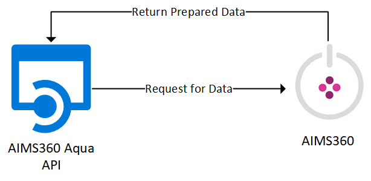
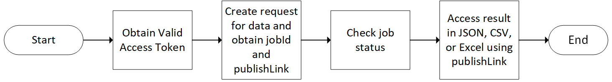

AIMS360 Aqua API
----------------

### Introduction

Aqua is a data extraction API designed to simplify data extraction from AIMS360.
Aqua leverages the AIMS360 Grid views to allow for simple and consistent access
to AIMS360 data via API calls. Using Aqua API, developers can extract data for
additional processing and analysis.

### Interaction with Aqua API

Aqua API is designed to process large number of records. Aqua API consumer data
request can be returns in JSON, Csv, or Excel. To achieve this consumer of Aqua
must complete the following steps:

1.  Obtain a valid access token. **Click here** to know how to get access token

2.  Create a request for data by posting to POST reports/v1.0/exportdata
    endpoint.

Endpoint input properties

| Field Name             | Field Description                                                                                                                                                                                       |
|:------------------------|:---------------------------------------------------------------------------------------------------------------------------------------------------------------------------------------------------------|
| exportType             | "exportType":"View"  Defines what needs to be exported. Valid values for this property are View: When AIMS360 View data needs to be exported Report: When AIMS360 Report data needs to be exported       |
| exportDataSettings     | The details required to export required data. For exporting AIMS360 View, the details of the View need to be specified and for exporting AIMS360 Report data, the report criteria need to be specified. |
| Source                 | "Source":"Orders" The source of the AIMS360 View.    Click here for the list of Sources                                                                                                                   |
| viewName               | "viewName": "Open Orders" The name of the AIMS360 View. This can be System View or the Custom View available in the View dropdown on the AIMS360 application for different modules                      |
| exportCriteriaVersion  | "exportCriteriaVersion": "v1.0" The version of the generated report/view                                                                                                                                |
| outputFormat           | "outputFormat": "csv" The preferred format of the output. The supported formats are Excel, PDF, Formatted Excel and JSON                                                                                |
| publishLinkAccessScope | "publishLinkAccessScope": "Private" The scope to access the publishlink. Valid scopes are Public, Private and PeopleInOrganization                                                                      |

3.  The endpoint returns the JobID, job status and Publishlink in the response.

Response properties

| Field Name             	| Field Description                                                                                                                                            	|
|:------------------------	|:--------------------------------------------------------------------------------------------------------------------------------------------------------------	|
| jobId                  	| "jobId": "XXXXXXXX-XXXX-XXXX-XXXX-XXXXXXXXXXXX" The ID of the job created to serve the request                                                               	|
| jobStatus              	| "jobStatus": "Queued" The status of the job                                                                                                                  	|
| publishLink            	| "publishLink":"https://api.aims360.rest/reports/v1.0/publishlink/XXXXXXXXXXXXXXXXXXXXXXXX/XXXXXXXXXXXXXXXXXXXXXXXX" The link to access the output of the job 	|
| publishLinkAccessScope 	| "publishLinkAccessScope": "Private"  The scope to access the publishlink. Valid scopes are Public, Private and PeopleInOrganization                          	|

4.  Check the status of the job by sending a request to

POST jobsmanagement/ v1.0/backgroundjob?\$filter=jobId eq '{{BackgroundJobID}}'

The output will be available once the job status is received as Completed. For more details about the Job status endpoint **click here**.

5.  Get the output/result using the Publishlink.

