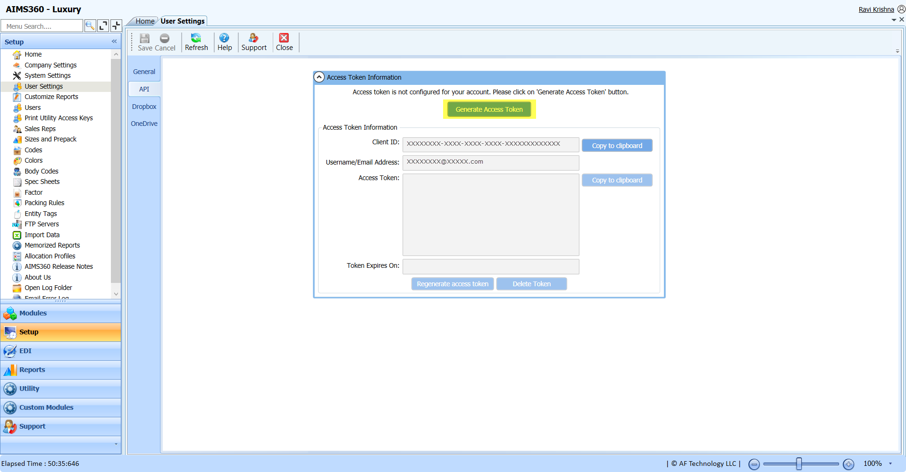
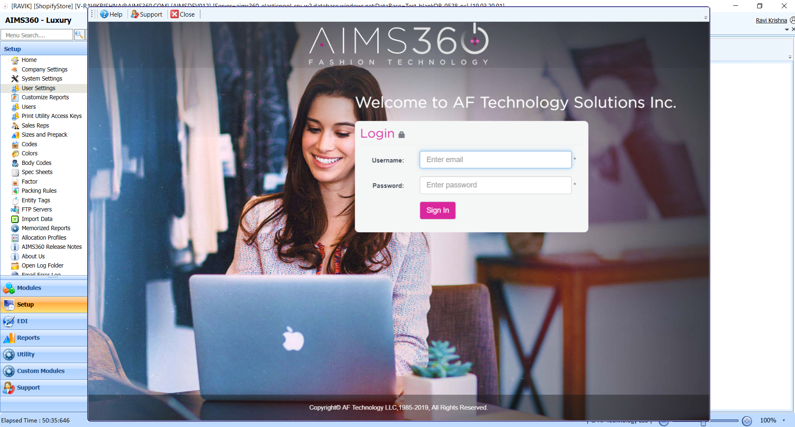
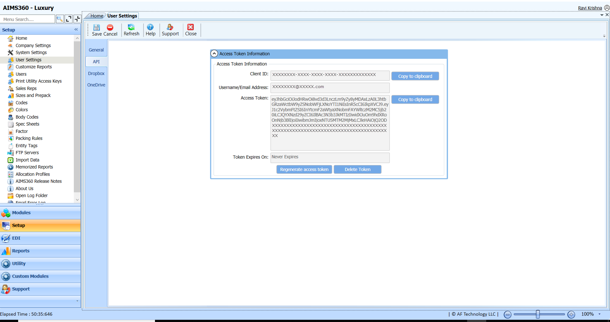
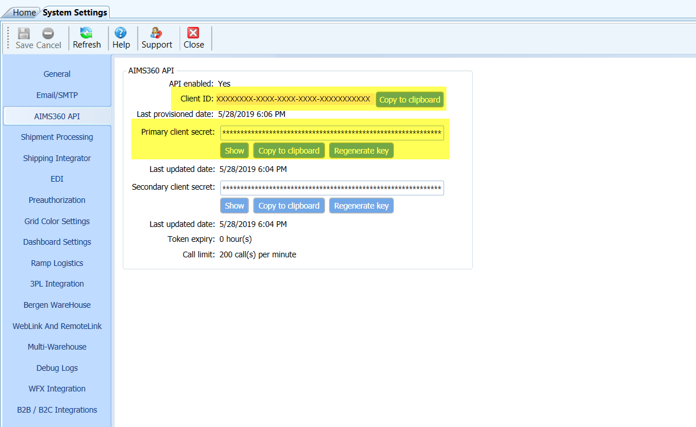
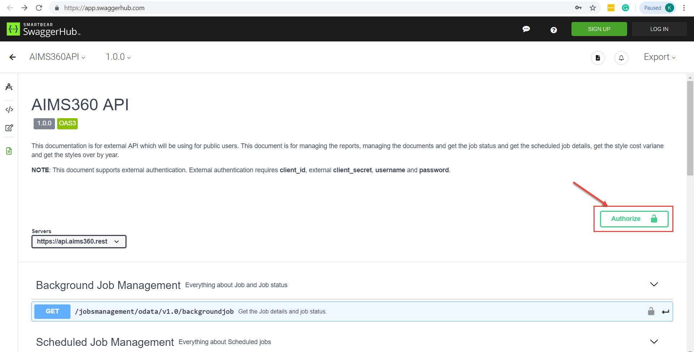
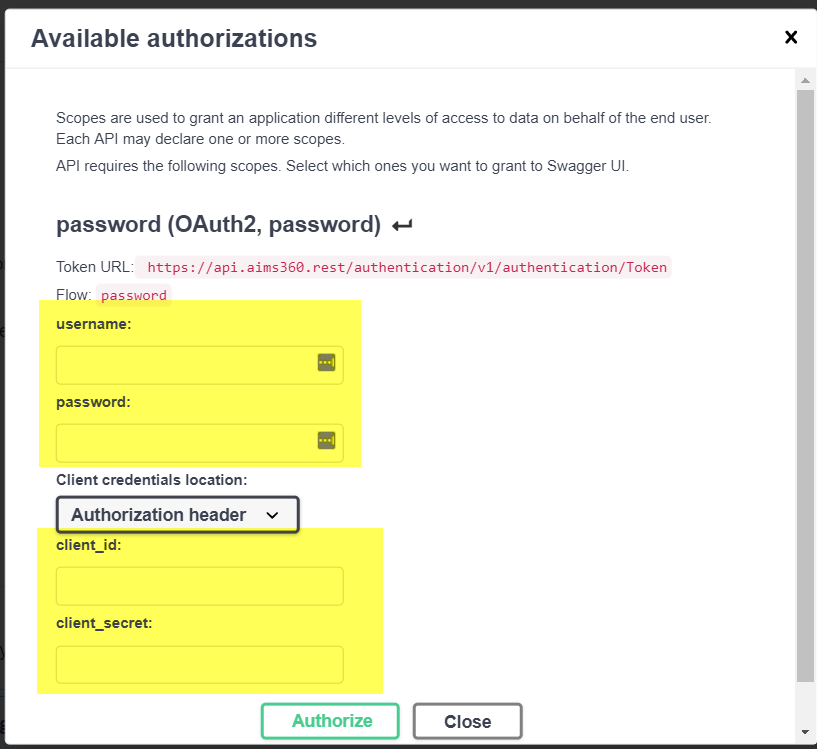
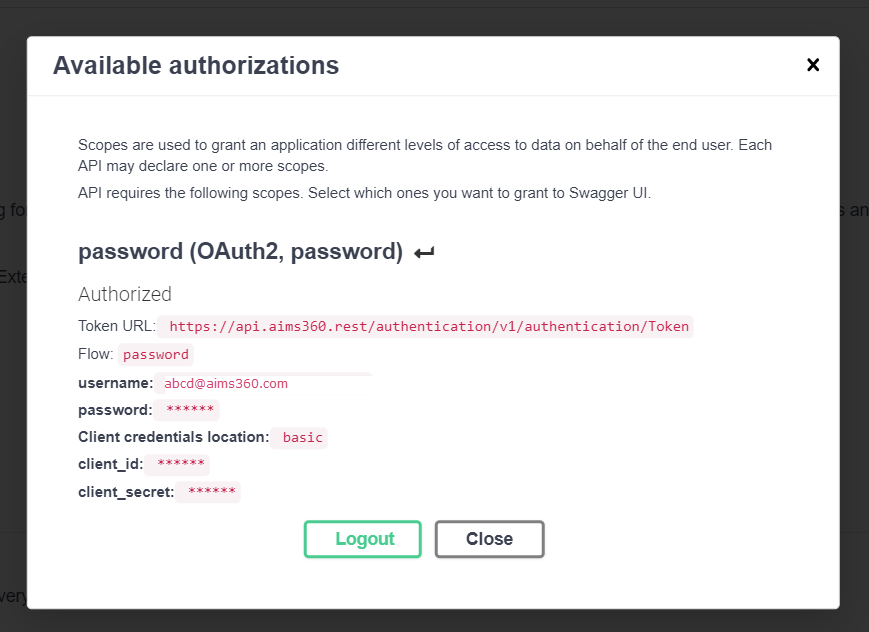

#### AIMS360 API Authentication
 
Authenticating via OAuth requires the generation of a bearer token. All requests need to include
Header Authorization.

Note: To generate Bearer token, the API access should be enabled in the Company
License.

#### Generating Bearer Token on AIMS360 ERP Application

Step 1: Login to AIMS360 ERP application using the Username and password

Note: The respective logged in Operator must have API permissions enabled to
generate Bearer Token. To get the API permissions enabled, contact your System
Administrator.

Step 2:

Navigate to API tab under User Settings. If the Bearer token/Access token is not
generated earlier, Generate Access token button will be available. Click on
Generate Access token button.

Step 3:

Enter the Username and Password on the AIMS360 login window displayed.

Step 4:

After Successful validation of the username and password, the Bearer
token/Access token will be generated and displayed on API tab

#### Generating a Bearer token on Swagger

Swagger URL: https://app.swaggerhub.com/apis-docs/AIMS360/AIMS360API/1.0.0

Step 1:

To generate bearer token, the Client ID and Secret key are necessary. Copy
client ID and secret from AIMS360 API tab under System Settings on AIMS360
application.

Step 2:

On Swagger documentation screen, click on Authorize button

Step 3:

On Authorization screen, provide the AIMS360 Operator Username, password, copied
Client ID and secret under Authorization Header. Click on Authorize button.

Note: AIMS360 Operator should be an active API User.

Step 4:

On successful validation of the provided details, bearer token will be generated
and configured.

Step 5:

After successful authentication, close the Authorization screen and now you are
ready to access the AIMS360 APIs.
