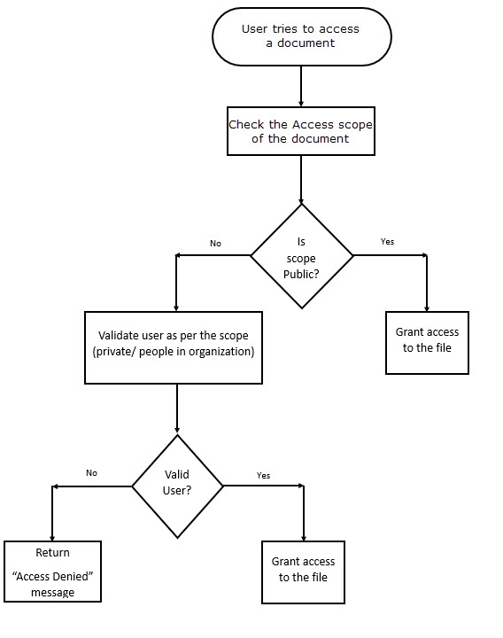

### Document Access Scopes

The following are the different types of Access scopes available for a
document

1.  Public

2.  Private

3.  People in Organization

**Document with Public Access scope:**

The Document with Public access scope is accessible by any one who tries to access. No authentication is required to access the document with access scope as Public.

**Document with Private Access scope:**

The Document with Private access scope is accessible only by the user who
created the document. The authentication will be done
when the document is tried to access and hence the Bearer token of the user who
tries to access should be passed.

**Document with People in Organization Access scope:**

The Document with People in organization access scope is accessible by any
users of the company to which the Document belongs. The authentication will
be done when the Document is tried to access and hence the Bearer token of the user
who tries to access should be passed.

### Flow when user tries to access the Document

When the user tries to access a Document,

1.  The scope of the document will be checked.

2.  Based on the access scope the user validation will be done. If the access
    scope is Public, no authentication will be done. If the access scope is
    Private/People in the organization, the user authentication will be done to
    make sure the user has access permissions to the document. For the
    authentication user needs to pass the Bearer token in the header when the API is called. For details on how to generate Bearer token [click
    here](https://github.com/AIMS360/API/blob/master/README.md).

3.  Upon successful user validation the document will be downloaded.

4.  If the validation fails, the user will be returned with Access Denied
    message.
 
