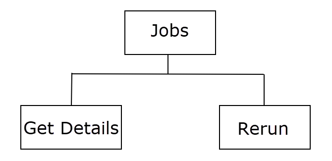

AIMS360 Jobs
------------

### Introduction

Any API which deals with huge data and takes time to process the requests will
be handled by a Background job. i.e. When such API is called, the request will
be placed in the queue and a job will be created to process the request. The
JobID and status will be returned optionally with a Publishlink as response to
the request.
<br>

The status of the job needs to be checked in the regular intervals and when the
job status is “Completed” the output will be ready to access.



### What you can do with the Jobs?

Below are the operations which can be performed related to the jobs


* `GET/jobsmanagement/odata/v1.0/backgroundjob?$filter=jobId eq '{jobID}'`<br>  Retrives the details of a job 

* `POST jobsmanagement/v1.0/backgroundjob/{jobID}/rerun` <br> Reruns the job

<br>


#### Job properties


| Field Name             	| Field Description                                                                                                                                            	|
|:------------------------	|:--------------------------------------------------------------------------------------------------------------------------------------------------------------	|
| jobID                       |  `"jobID": "d29fac30-650a-4ff2-b2b1-acab3c7472ea-20190607060819639"` <br>The unique ID of the job                                                                                                                                                                                                                                                                                                                                                                                                                                                        |
| categoryName                | `"categoryName": "Reports"` <br>The name of the category to which the job belongs                                                                                                                                                                                                                                                                                                                                                                                                                                                                        |
| subCategoryName             | `"subCategoryName": "Production Forecasting Report"` <br>The name of the sub-category to which the job belongs                                                                                                                                                                                                                                                                                                                                                                                                                                           |
| jobDescription              | `"jobDescription": "Create Production Forecasting Report"` <br>The description of the job                                                                                                                                                                                                                                                                                                                                                                                                                                                                    |
| clientID                    | `"clientID": "44FDE9CF-230A-4516-A128-AE464776F1C5"` <br>The unique ID of the Client who made the actual request for which the job is created                                                                                                                                                                                                                                                                                                                                                                                                                    |
| databaseName                |   `"DatabaseName": "AZ0XXData1"` <br>The name of the client's database                                                                                                                                                                                                                                                                                                                                                                                                                                                                                   |
| accountCode                 | `"accountCode": "AZ022"` <br>The AIMS360 account code of the client                                                                                                                                                                                                                                                                                                                                                                                                                                                                                              |
| clientRequestId             | `"clientRequestId": null` <br>The request ID passed by the Client when the actual request was made for which the job is created                                                                                                                                                                                                                                                                                                                                                                                                                                                                                                      |
| jobStatus                   |  `"jobStatus": "Completed"` <br>The status of the job. The possible values are Queued, Inprogress, Completed and Failed                                                                                                                                                                                                                                                                                                                                                                                                                                                 |
| jobStatusText               |  `"jobStatusText": "Production forecast report completed."` <br>The description about the job status                                                                                                                                                                                                                                                                                                                                                                                                                                                         |
| percentCompleted            | `"percentCompleted": 100` <br>The percentage of job completion                                                                                                                                                                                                                                                                                                                                                                                                                                                                                           |
| responseType                |  `"responseType": "Publishlink"` <br>The format of response for the job. The possible values are In-line JSON or Publishlink. <br> <br> If the size of the response is huge,  a document will be created with job response and publishlink to access the document will be returned in response for the job. In this case the responseType will be "Publishlink". Another request needs to be made to the publishlink to download the job's output <br> <br>If the size of response is small, it will be returned in JSON format and the responseType will be "In-line JSON". No further request need to be made for the response.                                                                                                                                                                                                                                                                                                                                                                                                                                                                                      |
| publishLink                 | `"publishLink":"https://apieast.aims360.rest/documentmanagement/v1.0/aimsdocument/6576767c-a264-4fc5-a30b-45e7a8c2fa84-20190820140000006/Uv7TuKIkD644DnvvmLIe4Am0bVnFZK1y2pLilTKWWBDCh3xUOyxbhgyjhhm9foFCF24zhDe74VkktvnjC8vL8e4ou8fiyxfIabeM20190820000000000"` <br>The link to access the output of the job                                                                                                                                                                                                                                                                                                                                                                                       |
| publishLinkAccessScope      | `"publishLinkAccessScope": "Private"` <br>The scope to access the publishlink. Valid scopes are Public, Private and PeopleInOrganization <br> For more details on Publishlink Access Scopes, [click here](https://github.com/AIMS360/API/tree/master/Jobs/Publishlink%20Access%20Scopes)                                                                                                                                                                                                                                                                                                                                                                                                                |
| response                    | `"response": "[{\\"DocumentGUID\\":\\"d29fac30-650a-4ff2-b2b1-acab3c7472ea-20190607060819639\\",\\"documentName\\":\\"Forecasting_20190607060922.xlsx\\",\\"DownloadLink\\":\\"https://api.aims360.rest/documentmanagement/v1.0/aimsdocument/d29fac30-650a-4ff2-b2b1-acab3c7472ea-20190607060819639/4wwrcVf6HjwefEBkCuKvCfsAZBMKALdKUDrT1a1ou7pT4sn84NONPQPx9StenougircnaZN5sxB7c0JMNRLqe67QhpWVLkUJQY3d20190607000000000\\",\\"SizeInMB\\":0.00130367279,\\"Type\\":\\".xlsx\\",\\"ExpiryDate\\":\\"2019-07-07T06:09:22.6593866Z\\"}]"` <br> The response of the job. <br> If the responseType is Publishlink, the details of the document in which the job response is saved will be passed in response. <br> If the responseType is In-line JSON, the JSON job output will be passed in response. |
| requestURL                  | `"requestURL": "https://api.aims360.rest/documentmanagement/v1.0/aimsdocument/1b59c33b-589b-4356-b829-908614848403-20190607060901986"`   <br>      The URL to access the actual request for which the job is created                                                                                                                                                                                                                                                                                                                                                                                                |
| startDate                   |  `"startDate": "2019-06-07T06:08:19.64Z"` <br>The date when the job started                                                                                                                                                                                                                                                                                                                                                                                                                                                                              |
| completedDate               | `"completedDate": "2019-06-07T06:09:22.737Z"` <br>The date when the job is completed                                                                                                                                                                                                                                                                                                                                                                                                                                                                     |
| purgeDateTime               |   `"purgeDateTime": "2019-07-07T06:08:19.64Z"` <br>The date and time when the job details will be purged.                                                                                                                                                                                                                                                                                                                                                                                                         |
| canReRun                    |  `"canReRun": "Yes"` <br>Determines whether the job can be run again or not                                                                                                                                                                                                                                                                                                                                                                                                                                                                              |
| createdBy                   |   `"createdBy": "support\@aims360.com"` <br>The email address of the operator who made the actual request for which the job gets created                                                                                                                                                                                                                                                                                                                                                                                                   |
| createdDate                 |  "createdDate": "2019-06-07T06:08:19.64Z" <br> The date and time when the job is created                                                                                                                                                                                                                                                                                                                                                                                                                                                                |
| modifiedBy                  | `"modifiedBy": "support\@aims360.com"` <br>The email address of the operator who modified job details most recently                                                                                                                                                                                                                                                                                                                                                                                                                                                  |
| modifiedDate                | `"modifiedDate": "2019-06-07T06:09:22.737Z"` <br>The date and time when the job is modified                                                                                                                                                                                                                                                                                                                                                                                                                                                              |

<br>

  
 ### Endpoints

**Retrives the status of a job**
```
  GET/jobsmanagement/odata/v1.0/backgroundjob?$filter=jobId eq '{jobID}'
  ```


**Response**

```json
{
  "@odata.context": "https://apiwest.aims360.rest/jobsmanagement/odata/v1.0/$metadata#backgroundjob",
  "value": [
    {
      "@odata.etag": "W/\"YmluYXJ5J0FBQUFBQUFMRHVvPSc=\"",
      "categoryName": "Reports",
      "subCategoryName": "Production Forecasting Report",
      "jobDescription": "Create Production Forecasting Report",
      "clientRequestId": null,
      "jobStatus": "Completed",
      "jobStatusText": "Production forecast report completed.",
      "publishLink": "https://apieast.aims360.rest/documentmanagement/v1.0/aimsdocument/6576767c-a264-4fc5-a30b-45e7a8c2fa84-20190820140000006/Uv7TuKIkD644DnvvmLIe4Am0bVnFZK1y2pLilTKWWBDCh3xUOyxbhgyjhhm9foFCF24zhDe74VkktvnjC8vL8e4ou8fiyxfIabeM20190820000000000",
      "requestURL": "https://apieast.aims360.rest/documentmanagement/v1.0/aimsdocument/d29fac30-650a-4ff2-b2b1-acab3c7472ea-20190607060819639",
      "publishLinkAccessScope": "Public",
      "percentCompleted": 100,
      "jobID": "d29fac30-650a-4ff2-b2b1-acab3c7472ea-20190607060819639",
      "responseType": "Publishlink",
      "response": "[{\"documentName\":\"Forecasting_20190820145657.xlsx\",\"DownloadLink\":\"https://apieast.aims360.rest/documentmanagement/v1.0/aimsdocument/6576767c-a264-4fc5-a30b-45e7a8c2fa84-20190820145631886/Uv7TuKIkD644DnvvmLIe4Am0bVnFZK1y2pLilTKWWBDCh3xUOyabgIpFD1m9foFCF24zhDe74VkktvnjC8vL8e4ou8fiyxfIabeM20190820145633280\",\"SizeInMB\":0.0,\"Type\":\".xlsx\",\"DocumentID\":\"6576767c-a264-4fc5-a30b-45e7a8c2fa84-20190820145631886\",\"ExpiryDate\":\"2019-09-19T14:56:59.6471867Z\",\"Version\":\"1.0\"}]",
      "startDate": "2019-08-20T14:56:31.887Z",
      "completedDate": "2019-08-20T14:57:00.023Z",
      "purgeDateTime": "2019-09-19T14:56:31.887Z",
      "clientID": "60619CAB-BA12-40BE-8902-843354325012",
      "DatabaseName": "AZSTEData1",
      "accountCode": "AZ0012",
      "canReRun": "Yes",
      "createdBy": "support@aims360.com",
      "createdDate": "2019-08-20T14:56:31.887Z",
      "modifiedBy": "support@aims360.com",
      "modifiedDate": "2019-08-20T14:57:00.023Z"
    }
  ],
  "@odata.nextLink": "https://apiwest.aims360.rest/jobsmanagement/odata/v1.0/backgroundjob?$filter=jobId%20eq%20%276576767c-a264-4fc5-a30b-45e7a8c2fa84-20190820145631886%27&$skip=100"
}
```
<br>

--------

  **Reruns a job**
 ```
  POST/jobsmanagement/v1.0/backgroundjob/{jobID}/rerun
  ```
Reruns the job only if the "canReRun" property for the job is  "Yes".

 **Response**

```json
{
  "jobId": "6576767c-a264-4fc5-a30b-45e7a8c2fa84-20190820145631886",
  "jobStatus": "Queued",
  "publishLink": "https://apieast.aims360.rest/documentmanagement/v1.0/aimsdocument/6576767c-a264-4fc5-a30b-45e7a8c2fa84-20190820145631886/Uv7TuKIkD644DnvvmLIe4Am0bVnFZK1y2pLilTKWWBDCh3xUOyabgIpFD1m9foFCF24zhDe74VkktvnjC8vL8e4ou8fiyxfIabeM20190820145633280",
  "publishLinkAccessScope": "PUBLIC"
}
```
<br>