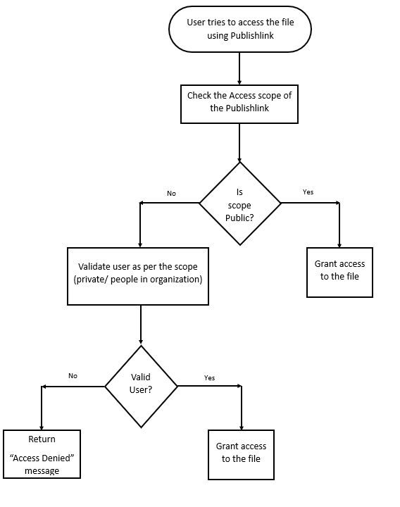

### Publishlink Access Scopes

The following are the different types of Access scopes available for the
publishlinks

1.  Public

2.  Private

3.  People in Organization

**Publishlink with Public Access scope:**

The Publishlink with Public access scope is accessible by any one with the
publishlink. No authentication is required to access the file associated to the publishlink with access scope as Public.

**Publishlink with Private Access scope:**

The Publishlink with Private access scope is accessible only by the user who
created the Publishlink.

**Publishlink with People in Organization Access scope:**

The Publishlink with People in organization access scope is accessible by any
users of the company to which the Publishlink belongs.

### Flow when user tries to access a file using Publishlink

When the user tries to access a file using the Publishlink,

1.  The scope of the publishlink will be checked.

2.  Based on the access scope the user validation will be done. If the access scope is Public, no authentication will be done. If the access scope is Private/People in the organization, the user authentication will be done to make sure the user has  access permissions to the file. For the authentication user needs to pass the Bearer token in the header with the publishlink. For details on how to generate Bearer token [click here](https://github.com/AIMS360/API/blob/master/README.md).

3.  Upon successful user validation the file can be accessed by the user.

4.  If the validation fails, the user will be returned with Access Denied message.
