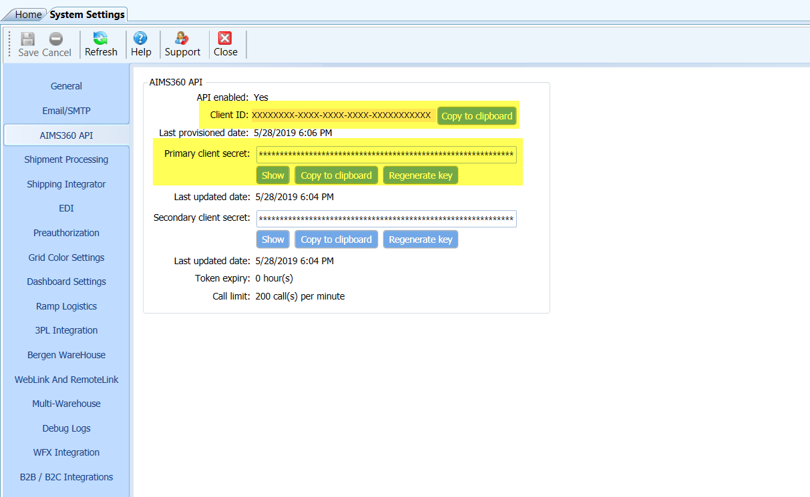
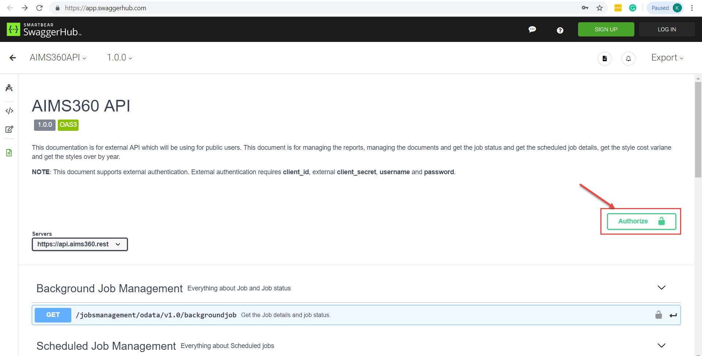
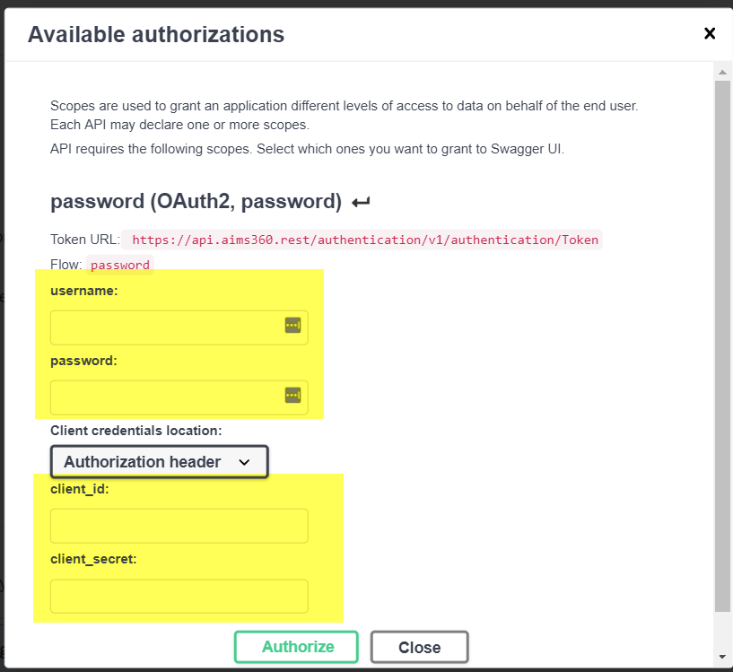
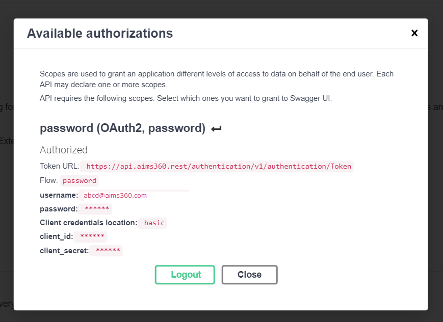

**AIMS360 API**

**Overview**

The AIMS360 API allows you to access features on AIMS360 ERP application using
Application Programing Interface. The API is a RESTful service which accepts
input in JSON or query string format and return response as JSON or any other
preferred supported format (excel/CSV/PDF).

**Authentication**

The API endpoints require authorization to retrieve or set data. AIMS360
recommends you use OAuth v2.0 to authenticate to the REST API. Authenticating
via OAuth requires the generation of a bearer token.

Generating a Bearer token

Step 1:

To generate bearer token, the Client ID and Secret key are necessary. Copy
client ID and secret from AIMS360 API tab under System Settings on AIMS360
application.

Step 2:

On Swagger documentation screen, click on Authorize button

Step 3:

On Authorization screen, provide the Username, password and copied Client ID and
secret under Authorization Header. Click on Authorize button.

Step 4:

On successful validation of the provided details, bearer token will be generated
and configured.

